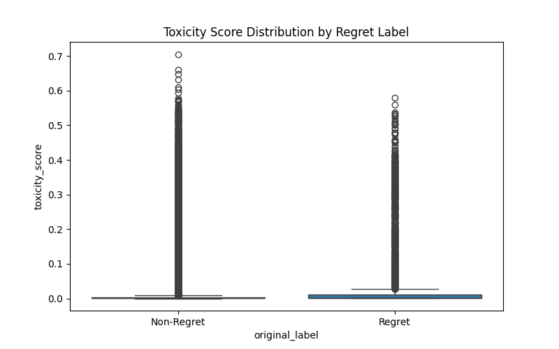
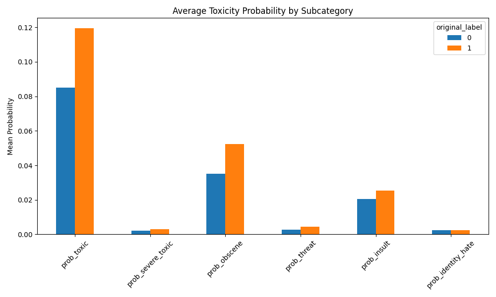

# No Regrets! – Pre‑Post Warning System

This repository contains the code and models for the **CS5246 Text Mining** final project.  
The goal is to warn users before they post something that might lead to regret – by detecting  
toxic language, sensitive information, and other regret‑related signals.

## Table of Contents

- [Project Overview](#project-overview)
- [File Structure](#file-structure)
- [Setup & Installation](#setup--installation)
- [Reproducing the Results](#reproducing-the-results)
  - [Step 1: Build the Dataset](#step-1-build-the-dataset)
  - [Step 2: Extract Toxicity Features](#step-2-extract-toxicity-features)
  - [Step 3: Exploratory Data Analysis (EDA)](#step-3-exploratory-data-analysis-eda)
  - [Step 4: Train and Evaluate Models](#step-4-train-and-evaluate-models)
- [Results](#results)
- [Demo](#demo)
- [Limitations and Future Work](#limitations-and-future-work)
- [References](#references)

---

## Project Overview

Many social media users regret posts that contain offensive remarks or reveal sensitive information.  
This project builds a text classification system that:

- Detects **regrettable content** (toxicity + regret‑related emotions).
- Identifies **sensitive information** (phone numbers, emails, NRIC).
- Provides a **warning** and suggests **redacted text**.
- Explains the prediction (top‑contributing features).

We use the **GoEmotions** dataset (mapped to binary regret/not‑regret) and extract toxicity features with `unitary/toxic-bert`.  
A TF‑IDF + Logistic Regression model achieves the best performance (F1 = 0.56 for the regret class).

---

## File Structure

After running all scripts, the repository will look like this:
```
CS5246_NoRegrets_Project/
├── data/                               # generated after Step 1 & 2
│   ├── reddit_regret_data.csv          # raw text + binary label
│   ├── analyzed_data.csv               # toxicity features added
│   ├── toxicity_boxplot.png            # EDA output
│   └── toxicity_subcategory_bars.png   # EDA output
├── models/                             # generated after Step 4
│   ├── enhanced_rf.pkl                 # Random Forest (hand‑crafted features)
│   ├── tfidf_lr.pkl                    # Best model (TF‑IDF + LR)
│   └── tfidf_vectorizer.pkl            # TF‑IDF vectorizer
├── src/                                # all source code
│   ├── build_goemotions_dataset.py     # Step 1
│   ├── data_collector_local.py         # Step 2
│   ├── eda_preprocess.py               # Step 3
│   ├── baseline_model.py               # unbalanced baseline
│   ├── balanced_model.py               # with class_weight / SMOTE
│   ├── enhanced_model.py               # additional features + saving
│   ├── tfidf_comparison.py             # TF‑IDF baseline
│   ├── warning_ui.py                   # Gradio demo
│   └── utils.py                        # helper functions
├── .gitignore
├── requirements.txt
└── README.md
```

---


## Setup & Installation

Follow these steps to create a clean conda environment and install dependencies.

```bash
# 1. Create a new conda environment with Python 3.11
conda create -n no_regrets python=3.11 -y

# 2. Activate the environment
conda activate no_regrets

# 3. Clone the repository (or navigate to your local copy)
git clone https://github.com/Xiaoda-Zhong/CS5246_NoRegrets_Project.git
cd CS5246_NoRegrets_Project

# 4. Install required packages
pip install -r requirements.txt

# 5. Download TextBlob corpora (for sentiment analysis)
python -m textblob.download_corpora
```

---

## Reproducing the Results

All scripts should be run from the project root (`CS5246_NoRegrets_Project/`).

### Step 1: Build the Dataset
```bash
python src/build_goemotions_dataset.py
```

### Step 2: Extract Toxicity Features
```bash
python src/data_collector_local.py
```

### Step 3: Exploratory Data Analysis (EDA)
```bash
python src/eda_preprocess.py
```

Creates boxplot and subcategory bar chart.
<table>
  <tr>
    <td align="center">
      
      <br/><em>Figure 1: Toxicity score distribution by regret label</em>
    </td>
    <td align="center">
      
      <br/><em>Figure 2: Average toxicity probability by subcategory</em>
    </td>
  </tr>
</table>

### Step 4: Train and Evaluate Models
We provide several scripts to compare performance.

#### 4.1 Baseline (unbalanced)
```bash
python src/baseline_model.py
```
Shows that without handling imbalance, the model ignores the regret class completely.

#### 4.2 Balanced Models (class_weight & SMOTE)
```bash
python src/balanced_model.py
```

#### 4.3 Enhanced Model (adds sensitive info, length, polarity)
```bash
python src/enhanced_model.py
```

#### 4.4 TF‑IDF + Logistic Regression (best model)
```bash
python src/tfidf_comparison.py
```

---

## Results

The best performing model is **TF‑IDF + Logistic Regression (balanced)**.

| Model                          | Accuracy | Precision (class 1) | Recall (class 1) | F1 (class 1) |
|--------------------------------|----------|---------------------|------------------|---------------|
| Unbalanced Logistic Regression | 0.89     | 0.00                | 0.00             | 0.00          |
| Balanced Logistic Regression   | 0.77     | 0.14                | 0.22             | 0.17          |
| SMOTE + Random Forest          | 0.79     | 0.16                | 0.23             | 0.19          |
| Enhanced Random Forest         | 0.80     | 0.26                | 0.44             | 0.33          |
| **TF‑IDF + LR (balanced)**     | **0.88** | **0.47**            | **0.70**         | **0.56**      |

> **Note**:
> - Unbalanced Logistic Regression fails to predict any positive sample (recall = 0).
> - Balanced Logistic Regression and SMOTE improve recall but still suffer from low precision.
> - Adding hand‑crafted features (sensitive info, text length, polarity) further lifts recall to 0.44.
> - TF‑IDF with class‑weighted logistic regression achieves the best trade‑off.

---

## Demo
Run the Gradio web interface:
```bash
python src/warning_ui.py
```
Then open the provided local URL.
Paste a draft – the system will:

- Predict the probability of regret.
- Detect sensitive information (phone, email, NRIC).
- Show a warning and suggest an automatically redacted version.

Example screenshot:
